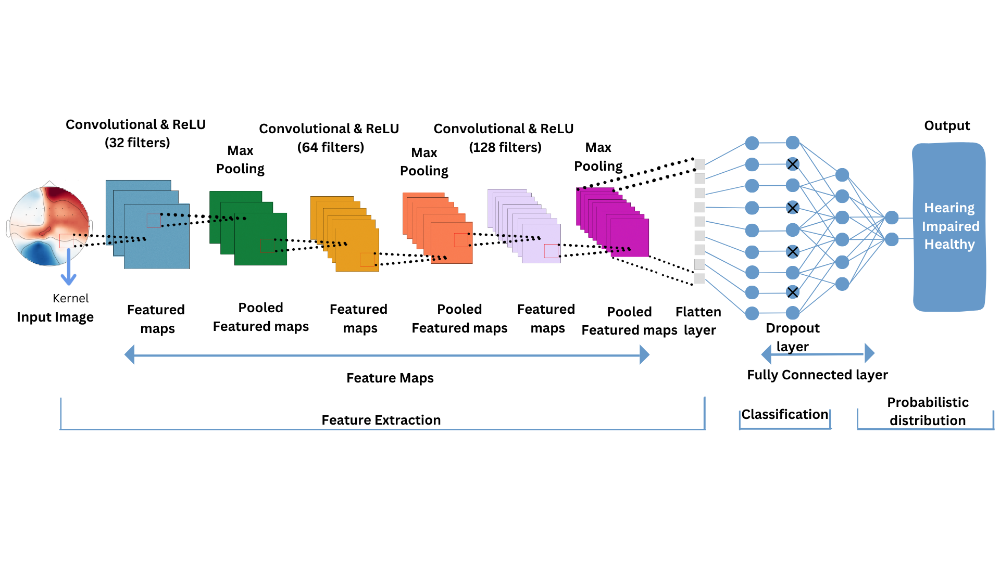

# Topographical Scalp Maps for Hearing Impairment Detection: A CNN Approach

**Author:** Grace Wang  
**Mentor:** Dr. Beiyu Lin, Dr. Brendan Morris
**Date:** June-August 2023

## Abstract

This project focuses on utilizing scalp maps derived from spatial and temporal electroencephalography (EEG) data to distinguish between individuals with hearing impairment and healthy individuals. A Convolutional Neural Network (CNN) model is trained to recognize patterns in the EEG data, achieving an accuracy of 85%-95%. This advanced approach has the potential to improve hearing impairment detection methods, benefiting both individuals and healthcare professionals.

## Introduction
 It is estimated that more than 50% of people over the age of 65 experience some form of hearing loss. 
The normal hearing threshold for healthy individuals is 0 to 20 dB. A person is considered hearing impaired if their hearing threshold is greater than 35 decibels (dB) in the better hearing ear. This poses challenges for communication without the use of hearing aids or assistive devices.

This study explores a novel approach by using scalp maps derived from spatial and temporal EEG data to detect hearing impairment. EEG, being non-invasive and affordable, presents an opportunity for early intervention and cost-effective healthcare. A deep learning CNN model is employed due to its suitability for image-based data, potentially leading to more efficient and accurate detection methods.

## Terminologies

- **EEG (Electroencephalography):** Technique to record brain's electrical activity via scalp electrodes.
- **ERPs (Event-Related Potentials):** Components of EEG signal time-locked to events.
- **Scalp Maps:** Graphical representation of brain activity distribution.
- **Spatial EEG Data:** Patterns of electrical activity across scalp regions.
- **Temporal EEG Data:** Patterns of electrical activity over time.
- **EEG Preprocessing:** Data cleaning and enhancement to remove noise.
- **Feature Extraction:** Identifying relevant features from ERP waveforms.

## Database

The dataset comprises EEG data from 22 hearing-impaired and 22 age-matched normal hearing individuals. ERPs were recorded during passive listening to tone stimuli. Each subject underwent 180 repetitions of tone stimuli, resulting in 1,760 images for the CNN model.

## Methods

The study encompasses EEG signal processing, ERP extraction, topographic brain map extraction, and CNN model training.

### EEG Preprocessing

Preprocessing and ERP extraction were done by dataset researchers. The code and analysis details are available in the [repository](https://gitlab.com/sfugl/snhl).

### ERP Extraction

Figures in the repository show individual traces of ERP data averaged over electrode clusters. Mean averages are calculated using the script at `snhl/reports/paper/func/extract_erp.m`.

### Topographic Brain Maps

Using ERPs, scalp maps are extracted at 10 ms intervals, resulting in 40 scalp maps per subject. This provides 1,760 images for the CNN model.

### CNN Architecture

The CNN model comprises convolutional and pooling layers, with a final dense layer for classification.

## Results

### Experiments

#### Experiment 1: 70% Training, 30% Testing

- Accuracy: 86%

#### Experiment 2: 80% Training, 10% Validation, 10% Testing

- Accuracy: 95%

#### Experiment 3: 70% Training, 15% Validation, 15% Testing

- Accuracy: 89%

### Experiments Summary

Table 4: Experiment Results

| Experiment | Training Data | Validation Data | Testing Data | Test Loss | Test Accuracy |
|------------|---------------|-----------------|--------------|-----------|--------------|
| 1          | 70%           | --              | 30%          | 0.379     | 0.865        |
| 2          | 80%           | 10%             | 10%          | 0.227     | 0.950        |
| 3          | 70%           | 15%             | 15%          | 0.470     | 0.891        |

## Conclusions

The CNN architecture achieves approximately 85%-95% accuracy in detecting hearing impairment based on scalp maps derived from EEG data.

## Future Work

- Use a larger dataset for better generalization.
- Explore alternative machine learning methods.
- Fine-tune model parameters for improved performance.

A detailed paper and poster is located in the documents folder.
